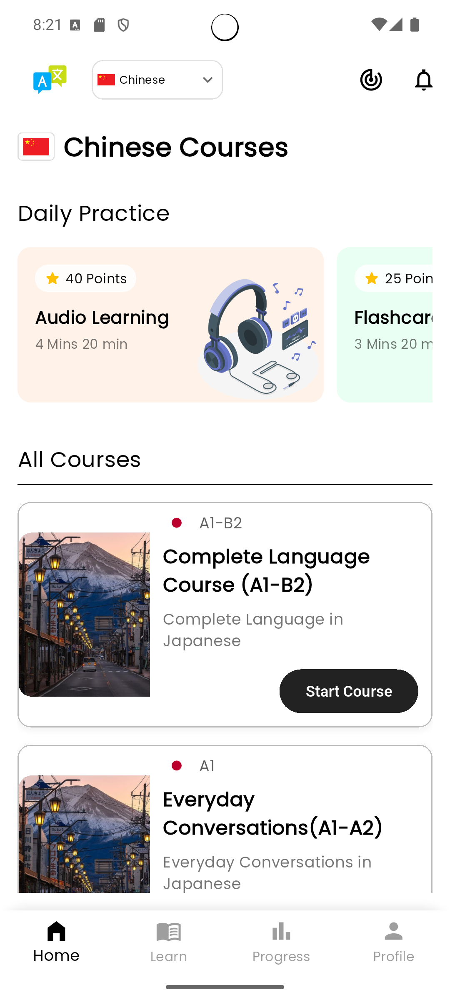
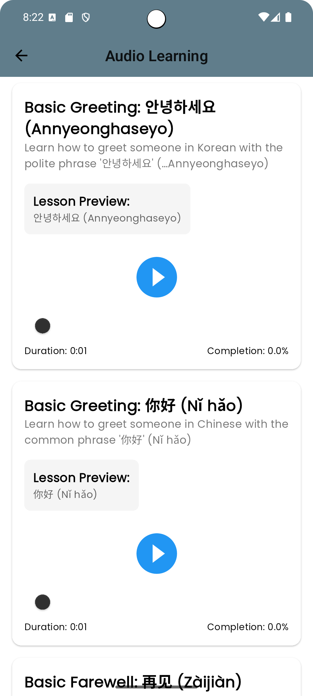

Learnara
Introduction
Learnara is an interactive language learning platform designed to help users master new languages effectively. It offers structured courses, engaging learning tools, and personalized goal tracking to enhance the learning experience. With multiple language options and various learning modes, Learnara makes language acquisition fun and accessible for all users.

Features
Courses – Structured lessons covering different proficiency levels.
Multiple Languages – Learn languages like Chinese, Korean, French, Italian, and more.
Goal Setting – Users can set and track their learning goals for motivation.
Profile Management – Personalized user profiles to track progress and achievements.
Audio Learning – Improve pronunciation and listening skills with interactive audio lessons.
Flashcards – Reinforce vocabulary with visual and interactive flashcards.
Quizzes – Test your knowledge and track progress with engaging quizzes.
Learnara makes language learning immersive and effective with its interactive approach! 🚀

## Screenshot

Below is a screenshot of the Calculator App:

 
 
 
 
 
